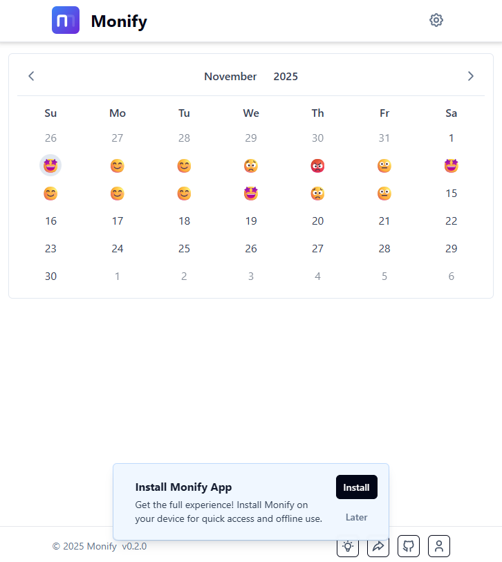

# Monify  calendario offline


**Monify** è un'applicazione web progressiva (PWA) progettata per offrire un sistema di gestione e visualizzazione di eventi e dati basati sul **calendario**. L'obiettivo primario è fornire agli utenti uno strumento semplice, rapido e **totalmente fruibile offline** per tracciare "umori" e note, con un'architettura pensata per essere estesa a qualsiasi tipo di dato temporale.

L'applicazione è costruita per essere veloce, affidabile e installabile su qualsiasi dispositivo, garantendo un'esperienza utente fluida e continua, anche senza connessione internet.




## ✨ Caratteristiche Principali

Monify è ricco di funzionalità pensate per l'utente moderno:

- **🗓️ Visualizzazione Calendario Mensile:** Un'interfaccia chiara e intuitiva per visualizzare gli umori e le note del mese a colpo d'occhio.
- **✍️ Inserimento, Modifica ed Eliminazione:** Gestisci facilmente i tuoi dati giornalieri. Aggiungi un umore e una nota, modificali in qualsiasi momento o cancellali con un semplice clic.
- **🌐 Esperienza Offline Completa:** Grazie a IndexedDB e Dexie.js, l'applicazione funziona perfettamente senza connessione a internet. Tutti i dati vengono salvati localmente nel browser.
- **📲 Installazione PWA:** Monify può essere installata su dispositivi desktop e mobili per un accesso rapido e un'esperienza nativa. Un popup guida gli utenti mobili all'installazione se non l'hanno ancora fatto.
- **💡 Suggerisci una Funzionalità:** La tua opinione conta! Un'apposita sezione permette agli utenti di suggerire nuove feature per migliorare l'applicazione.
- **📤 Esportazione Dati (CSV):** Esporta tutti i tuoi dati in formato CSV per averne una copia di backup o per analizzarli con altri strumenti.
- **🗑️ Cancellazione Completa dei Dati:** Vuoi ricominciare? Una funzione dedicata ti permette di eliminare tutti i dati salvati in modo sicuro e definitivo.
- **🧱 Navbar Essenziale:** Una navigazione semplice e pulita per accedere a tutte le funzionalità principali senza distrazioni.
- **ℹ️ Footer con Versione:** Tieni traccia della versione dell'applicazione che stai utilizzando direttamente dal footer.

## 🛠️ Stack Tecnologico

L'applicazione è costruita utilizzando tecnologie moderne e performanti per garantire la migliore esperienza utente possibile.

| Componente | Tecnologia | Ruolo |
| :--- | :--- | :--- |
| **Framework Frontend** | **Angular 20** | Framework principale per un'applicazione robusta, modulare e manutenibile. |
| **Componenti UI** | **PrimeNG 20** | Libreria di componenti UI per un'interfaccia ricca, accessibile e di alta qualità. |
| **Styling** | **Tailwind CSS 3** | Framework CSS utility-first per uno stile rapido, reattivo e personalizzabile. |
| **Database Locale** | **Dexie.js** | Wrapper per IndexedDB per una gestione dati offline potente, veloce e strutturata. |

## 🚀 Strategia di Deploy

Il deploy del progetto viene effettuato tramite **GitHub Pages**, una scelta che semplifica il processo di distribuzione continua (CI/CD) e offre un hosting gratuito e affidabile.

## ⚙️ Installazione e Avvio Locale

Per eseguire il progetto in locale, segui questi semplici passaggi:

1.  **Clona il repository:**
    ```bash
    git clone https://github.com/TUO_USERNAME/monify.git
    ```

2.  **Entra nella directory del progetto:**
    ```bash
    cd monify
    ```

3.  **Installa le dipendenze:**
    ```bash
    npm install
    ```

4.  **Avvia il server di sviluppo:**
    ```bash
    npm start
    ```
    L'applicazione sarà disponibile all'indirizzo `http://localhost:4200/`.

## 🤝 Come Contribuire

I contributi sono sempre i benvenuti! Se vuoi migliorare Monify, sentiti libero di aprire una **Pull Request** o segnalare un problema tramite le **Issues** di GitHub.

## 📄 Licenza

Questo progetto è rilasciato sotto la Licenza MIT. Vedi il file [LICENSE](LICENSE.md) per maggiori dettagli.

---

### Come utilizzare questo README:

1.  **Copia e incolla** il testo qui sopra in un nuovo file chiamato `README.md` nella root del tuo progetto GitHub.
2.  **Personalizza i link:**
    *   Sostituisci `https://github.com/TUO_USERNAME/monify.git` con l'URL effettivo del tuo repository.
    *   Assicurati di avere un file `LICENSE` nel tuo progetto, o rimuovi il link se preferisci non specificare una licenza.
3.  **Aggiungi badge:** Ho incluso un badge per la licenza. Puoi aggiungerne altri (es. per lo stato della build, la versione di Angular, ecc.) da siti come [Shields.io](https://shields.io/).

Questo README fornirà una panoramica completa e professionale del tuo progetto a chiunque visiti il tuo repository.